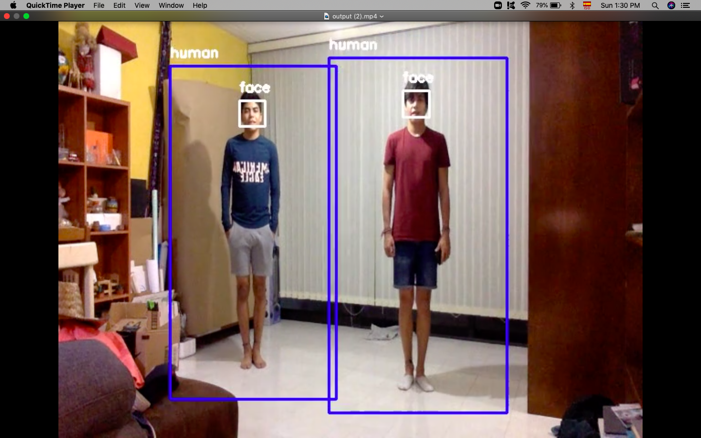
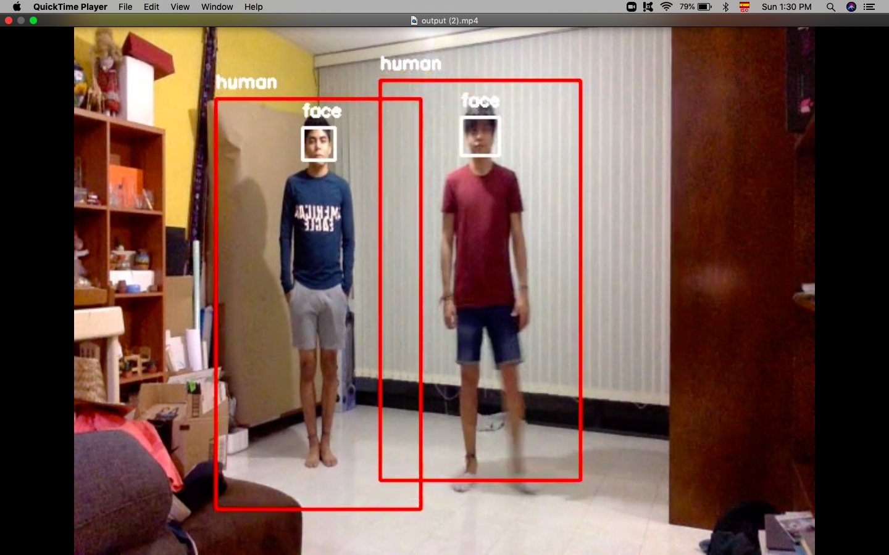
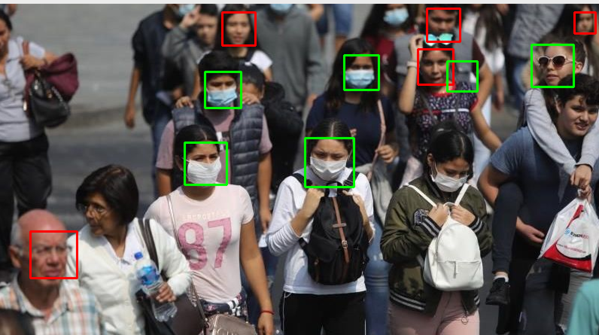

# Hackify Bonus Challenge
## Equipo3 - MataData

### Problema

Las personas con necesidad de salir no conocen como las demás personas cumplen con las recomendaciones de sana distancia, mucho menos al entrar a un edificio en donde hay un flujo constante de personas es puede causar desde incomodidad hasta pánico, y las autoridades o responsables de los lugares públicos no conocen cual es el comportamiento para poder tomar medidas específicas.

### Solución

El monitoreo de las personas que cumplen con las medidas de sana distancia y el cálculo de un indice que advierta los riesgos de entrar a un edificio para hacer mayor conciencia y dar tranquilidad a las personas de un comportamiento comun en un lugar específico

### Tecnología empleda:

Utilizamos como lenguaje de programación Python 3 y principalemente las librerias OpenCV y Pillow para el manejo de imagenes y Scikit Learn para el entrenamiento del clasificador. La integración la creamos sobre Jupyter Notebook en donde opera de forma limitada. Para ver siguientes pasos revisar la presentación

### Resultados

[Presentación](https://docs.google.com/presentation/d/1i5_KHpG_WIHBMmW2p-O4BR7EaWrRTZqDzrsLH9dihss/edit?usp=sharing)

### Ejemplos
**Se cumple Sana Distancia**

**No se cumple Sana Distancia**

**Identificación y Clasificación de Caras con y sin Mascarilla**

**Videos:**
1. [Identificador de Cuerpo + Criterio de Distancia](https://youtu.be/gz_abklO-U8)
2. [Pruebas de Clasificador de Caras](https://youtu.be/AGP-IsJ0AQo)
3. [Demo de Funcion con juguetes](https://youtu.be/ArKs-VdgAbQ)

### Desarrollado por:
[Alberto Ibarra](https://github.com/albertoid) y [Julio Cesar Renteria](https://github.com/juliocrn94) 
